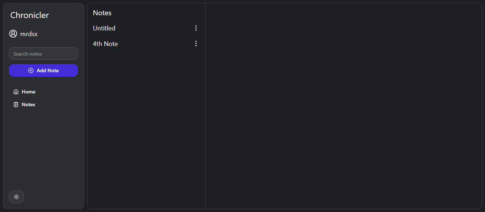

# Chronicler

Chronicler is the Note Taking app. That's all for now.

Light mode:


Dark mode:


## Features:

- Create/Edit/Delete notes
- Search notes
- Dark mode
- Integration with DB (In Progress)
- AI features (TODO)

## Installation guide

### Prerequisites

- [Node.js](https://nodejs.org/)
- [npm](https://www.npmjs.com/)
- [Git](https://git-scm.com/)
- [Python](https://www.python.org/)

### 1. Clone the Repository

```bash
git clone https://github.com/mrdsx/chronicler.git
cd chronicler
```

### 2. Setup environment variables

Clone [this](https://github.com/mrdsx/jwt-key-generator) repository in separate folder, install all dependencies by running `pip install -r requirements.txt` and run run.py. The script will create two files and you need to copy `.env` and paste it inside 'server' folder to be able to run the server. File `.env` should have variables like this:

```env
SECRET_KEY=
JWT_ALGO=
ES256_KID=

ES256_KEY=
```

### 3. Install Dependencies for Client

```bash
cd client
npm install
```

### 4. Run Client

```bash
npm run dev
```

OR

Run script run_client.bat in folder 'scripts'

### 5. Setup virtual environment for Server

Open another console, go to server folder and run following commands:

```bash
cd server
python -m venv .venv
.venv\Scripts\activate
```

### 6. Install Dependencies for Server

```bash
pip install -r requirements.txt
```

### 7. Run Server

```bash
python app/main.py
```

OR

Run script run_server.bat in folder 'scripts'

### 8. Open project in your browser.

Open [http://localhost:3000](http://localhost:3000/).

### Additional note

As you could notice, folder 'scripts' also contains script `run_app.bat` for running both client and server simultaneously.

## Tech Stack

<div style="display: flex">
  
  
  
  
  
  
  
</div>

## Libraries

- [React](https://react.dev/)
- [Tailwind](https://tailwindcss.com/)
- [Radix](https://www.radix-ui.com/) ([ShadCN](https://ui.shadcn.com/) components)
- [Lucide](https://lucide.dev/)
- [React Router](https://reactrouter.com/)
- [React Hook Form](https://react-hook-form.com/)
- [uuid](https://www.npmjs.com/package/uuid)
- [TanStack Query](https://tanstack.com/query/latest)
