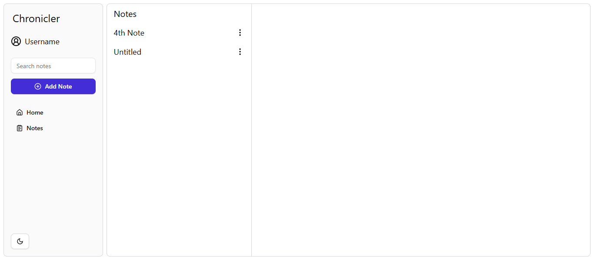

# Chronicler

Chronicler is the Note Taking app. That's all for now.



## Features:

- Create/Edit/Delete notes
- Search notes
- Dark mode

## Upcoming features:

- User Auth / Integration with DB
- AI summary per note
- AI suggestions

## Installation guide

### Prerequisites

- [Node.js](https://nodejs.org/)
- [npm](https://www.npmjs.com/)
- [Git](https://git-scm.com/)

### 1. Clone the Repository

```bash
git clone https://github.com/mrdsx/chronicler.git
cd chronicler
```

### 2. Install Dependencies and run the Dev Server

```bash
npm install
npm run dev
```

### 3. Open project in your browser.

Open [http://localhost:3000](http://localhost:3000/).

## Tech Stack

<div style="display: flex">
  
  
  
  
</div>

## Libraries

- [React](https://react.dev/)
- [Tailwind](https://tailwindcss.com/)
- [Radix](https://www.radix-ui.com/) ([ShadCN](https://ui.shadcn.com/) components)
- [Lucide](https://lucide.dev/)
- [React Router](https://reactrouter.com/)
- [React Hook Form](https://react-hook-form.com/)
- [uuid](https://www.npmjs.com/package/uuid)
